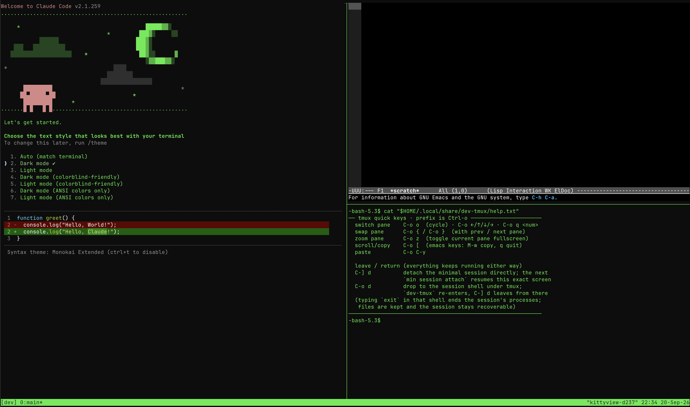

# loadout-claude-emacs

A [Minimal](https://minimal.dev) loadout: Emacs 30 with eglot and a 12-language
LSP roster, tree-sitter, vertico/consult/corfu and magit, plus claude-code, in a
three-pane tmux layout that opens on every attach.



## Install

Needs `min` 0.6 or newer (the `<name>/loadout.toml` layout). The directory
name is the loadout name, so clone straight into Minimal's loadouts directory:

```sh
git clone https://github.com/gominimal/loadout-claude-emacs ~/.config/minimal/loadouts/loadout-claude-emacs
~/.config/minimal/loadouts/loadout-claude-emacs/setup
min session activate --attach
```

Clone into a shorter directory name if you want a shorter loadout name.

`setup` writes `local/gitconfig` from your host git identity (edit it if
sessions should commit as someone else) and, if you have no
`~/.config/minimal/config.toml` yet, writes one that applies this loadout by
default; otherwise it tells you what to add. Other loadouts can be cloned next
to this one the same way.

Update with `git -C ~/.config/minimal/loadouts/loadout-claude-emacs pull`; new
sessions pick up the changes.

## In the session

- tmux prefix is `C-o`; the bottom-right pane shows a key cheatsheet.
- `C-] d` detaches the Minimal session; `min session attach` resumes the same screen.
- `C-o d` detaches from tmux and drops to the plain session shell; `dev-tmux` re-enters tmux.
- Emacs starts eglot for every language on the roster; `C-x g` opens magit.

## Layout

| file              | lands in the session as            | notes                                        |
|-------------------|------------------------------------|----------------------------------------------|
| `loadout.toml`    |                                    | packages, patches, vars                      |
| `init.el`         | `~/.config/emacs/init.el`          |                                              |
| `tmux.conf`       | `~/.tmux.conf`                     | prefix `C-o`, emacs keys, OSC 52 clipboard   |
| `bashrc`          | `~/.bashrc`                        | enters `dev-tmux` on attach                  |
| `dev-tmux`        | `~/.local/bin/dev-tmux`            | builds/attaches the tmux session             |
| `tmux-help.txt`   | `~/.local/share/dev-tmux/help.txt` | cheatsheet in the help pane                  |
| `git/config`      | `~/.config/git/config`             | gh credential helper, diff colours           |
| `git/ignore`      | `~/.config/git/ignore`             | global ignores                               |
| `local/gitconfig` | `~/.gitconfig`                     | your identity; untracked, written by `setup` |

Everything personal goes under `local/`, which git ignores.

## License

Apache-2.0, see [LICENSE](LICENSE).
